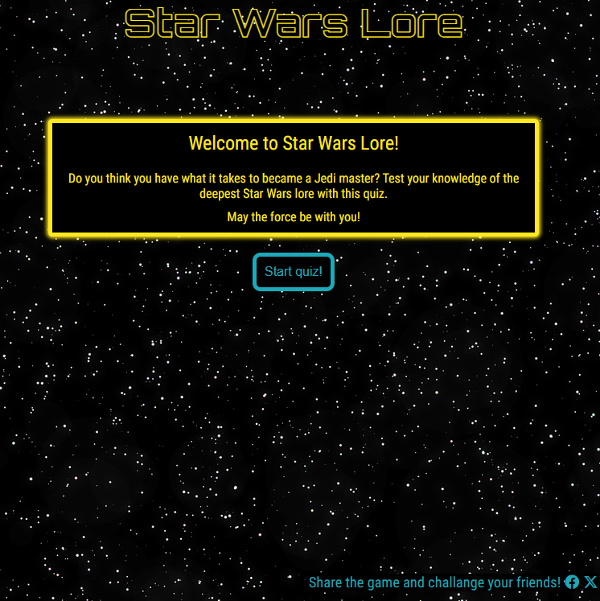
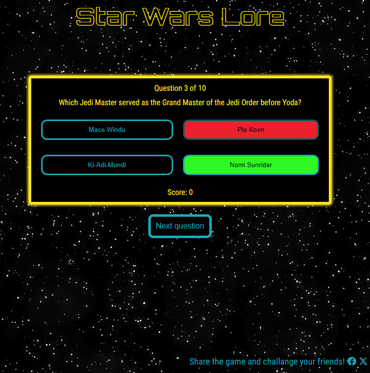
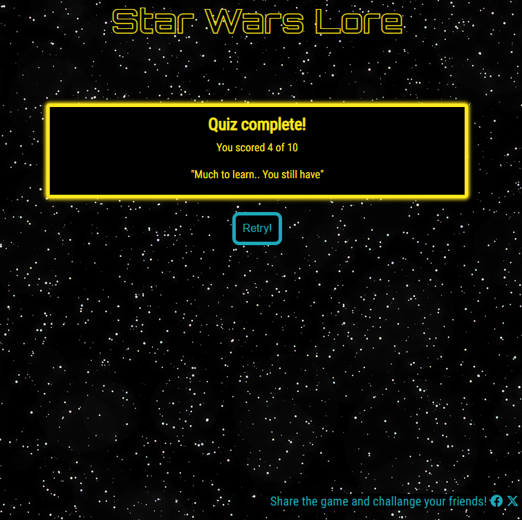

# Star Wars Lore
Star Wars Lore is a javascript quiz, created to be fun and engaging to fans of the Star Wars universe. It is designed with the classic Star Wars colors and to be used on your own or to challange friends for who can get the best score. The application is interactive and easy to use, with tough questions that can either prove you are a master of Star Wars knowledge or help you increase your knowledge! 

## Table of contents

- [User experience](#user-experience)
- [Planning and design](#planning-and-design)
- [Features](#features)
- [Technologies and languages uses](#technologies-and-languages-used)
- [Testing](#testing)
- [Deployment](#deployment)
- [Credits](#credits)

# User experience

This quiz is created to be a fun and challenging game for Star Wars enthusiasts. To test their knowledge and be able to challange friends. 

- As a user, I want to quickly understand what the quiz is about and how to start to quiz itself.
- As a user, I want to be able to play the quiz on laptop/desktop, tablet (touchscreen) and mobile (touchscreen).
- As a user, I would like to know my score as I play the game.
- As a user, I would like to get the correct answer shown when I answer incorrectly to learn more about the subject.
- As a user, I would like to have a way to share the Quiz the quiz URL with friends & family through social media (Facebook and Twitter).
- As a user, I would like to be able to quickly (with one click) retry and restart the quiz after finishing. 

# Planning and design

The website was planned and designed to give and authenic Star Wars feeling with the right colors and background image. It was also intended to be easy to use and give immediate feedback to the user, via colors and text. As well as excluding any extra pages and having all the content beeing manipulated and displayed on one page to increase swiftness and user experience. The website was also designed to be responsive with elements increasing in size for bigger screens and decreasing for smaller screens. 

The colors were chosen based on the colors in the opening "crawl" of the Star Wars movies. With the help of https://imagecolorpicker.com/. And the background image was chosen to give the feeling of "space". The font chosen for the header is "Orbitron", for its similarity to the official Star Wars font. The font for the the rest of the content is "Roboto Condensed", is similar to Orbitron but more clean and readable. 

## Wireframes 

The first design of the website was planned with a simple hierarchy, with the main game area taking up most of the space and the logo and footer placed to the top left and bottom right respectively. As seen on the wireframes below. 

This was changed while building the website, to a design where both the header (with the logo) and the game area with questions and answers were centered on the page. While the footer is still kept to the bottom right of the page.

Start page 

Game area 

End screen 

# Features 

## Existing features

### Start

A home page with a welcome text, with a fun and challenging tone. Inviting the user to try their knowledge. 
The start page contains a logo with the name of the website, which also is a link to the home page. 
There is a startbutton which starts the quiz and plays a sound of a lightsaber.
At the bottom right there is a footer inviting the user to share the quiz with a link on social media and challenge their friends. 

### Quiz

Once starting the quiz there is a game area, consistent with the design of the welcome screen. The game area contains a question counter at the top which lets the user know which question they are on and how many are left. As well as the question it self, with 4 answer buttons below. The questions displayed to the user are randomized, so that it does not show the same ones everytime the user starts the quiz. 

Once answered the button highlights the correct answer in green and if the user answered incorrectly, it shows that answer in red. Once the user has answered the answer buttons are disabled. There is also a button below for proceeding to the next question.

### End Game 
Once the user has finished the quiz, after 10 questions. They are presented with their score and a corresponding quote for different scores (0-3, 4-6, 7-9 and 10). A retry button appears which lets the user restart the quiz easily with one click only without having to go to the home page. 

## Future features
- The possibility to choose difficulty 
- Feature to create a screenshot with the score for the user to share

# Technologies and languages used

## Languages 
- HTML 
- CSS
- Javascript

## Technologies
- [Balsamiq](https://balsamiq.com/) was used to create the wireframes. 
- [Google Fonts](https://fonts.google.com/) was used for the fonts.
- [Fontawesome](https://fontawesome.com/) was used for social media icons in the footer.
- Git was used as version control, by pushing the code via the Gitpod terminal. 
- [GitHub](https://github.com/) is used as a repository for the code.
- [Favicon](https://favicon.io/favicon-converter/) was used to create the favicon

# Testing

# Deployment
The site was deployed through GitHub pages. The steps taken to deploy are as follows. 
- In the GitHub repository for the project, navigate to settings tab, then to pages on the left hand menu. 
- Select the main branch from the dropdown menu for branch. 
- Make sure that deploy from a branch is selected in the source menu.
- Click save and the page will be refreshed with a link to the live project. 

Live link to the project here https://morganstenberg.github.io/Star-wars-lore/ 

# Credits